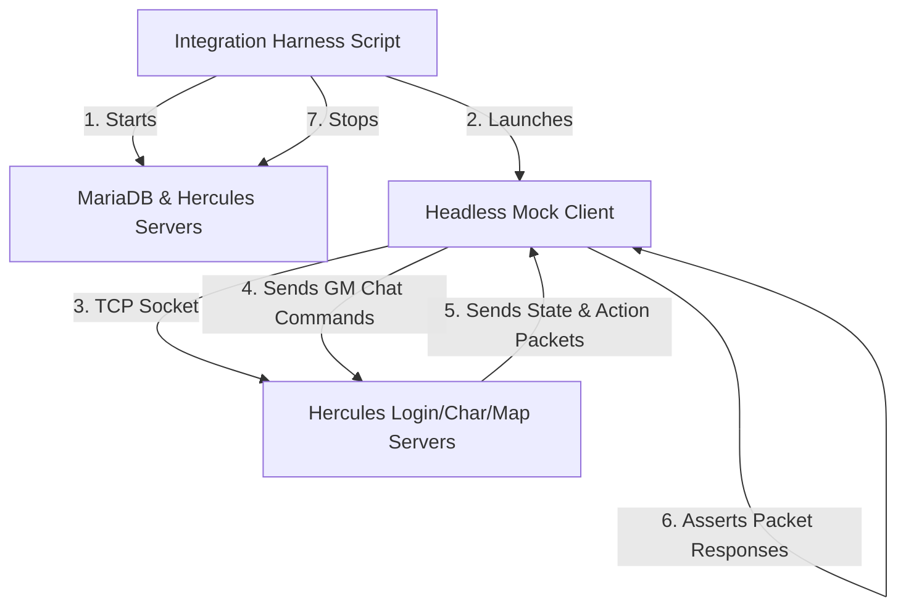

# Implementation Plan — Headless Mock Client & Integration Harness

> **Status (2026-07-11)**: Stage 1 + the core of Stage 2 are **implemented** as
> `korangar-networking/examples/headless-tester.rs` (login → char select → map load →
> chat round-trip smoke test, passing against the live server). The full scenario
> catalog now lives in [headless_test_plan.md](headless_test_plan.md); bugs found go in
> [headless_findings.md](headless_findings.md). This document remains as the original
> design rationale — scenario details below were corrected against the Hercules DBs
> (see HF-000 in the findings log).

This document outlines the design and implementation roadmap for a headless mock networking client for the **Korangar Client** to automate end-to-end integration testing against a live local **Hercules Server**.

---

## 1. Objectives & Goals
* **E2E Automation**: Test core networking state transitions (Login $\rightarrow$ Char Select $\rightarrow$ Map Load) without graphic dependencies.
* **Command Bootstrapping**: Allow the client to command-control its own environment using GM (Game Master) packets (job changes, stat modifications, warping).
* **Combat & Skill Testing**: Verify correct parsing and round-tripping of movement, physical attacks, and spell casting.
* **CI Integration**: Wrap the mock client and server lifecycle into a single, disposable shell execution script that exits nonzero on test failures.

---

## 2. Architecture & Crate Integration
The headless client resides at `korangar-networking/examples/headless-tester.rs`, modeled on the pre-existing `rescue-my-character.rs` example (which already implemented the full login → map connection flow headlessly).



### Key Dependencies:
* **`tokio`**: For non-blocking TCP socket stream reads and writes.
* **`ragnarok-packets`**: For packet structure definitions and serialization layout.
* **`korangar-networking`**: Reuses packet handlers and connection managers to interact with Hercules.

---

## 3. Headless Client State Machine
The headless client will execute a linear connection workflow, asserting state correctness at each stage:

```
  [Disconnected]
        |  (Connects to 6900)
        v
  [Login Handshake] ----> Awaits LoginSuccess (lists char servers)
        |
        |  (Connects to 6121)
        v
  [Character Select] ---> Awaits CharList, sends select character index
        |
        |  (Connects to 5121 with session token)
        v
  [Map Server Game Loop]
        |
        +---> Send GM commands (@job, @blevel, @allskill)
        +---> Assert update packets (JobId, BaseLevel, SkillList)
        +---> Execute scenario tests (move, attack, cast)
```

---

## 4. GM Command Bootstrapping & Scenario Tests
To test features like spell casting and class stats, the client will utilize the GM command loop using the public chat packet `GlobalMessagePacket` (`0x00F3`).

### Scenario 1: Walk Pathing Validation
1. Client sends a `RequestPlayerMovePacket` targeting coordinates `(170, 140)`.
2. Awaits the server's pathing acknowledgement or location broadcast packets.
3. Asserts the client's local coordinates match target within a specific time window.

### Scenario 2: High Wizard Spell Casting (Storm Gust)
1. **Bootstrap**:
   * Send `@job 4010` (changes class to High Wizard — `Job_High_Wizard` in `Hercules/db/constants.conf`).
   * Send `@blevel 98` / `@jlevel 69` and `@allskill` (grants all skills).
   * Await `ChangeJob` / `UpdateStat` / `SkillTree` events.
2. **Execute**:
   * Storm Gust is **ground-targeted** (`SkillType: Place` in `skill_db.conf`), so cast via
     `NetworkingSystem::cast_ground_skill` → `UseSkillOnGroundPacket` (`0x0AF4`):
     * `skill_id`: `89` (`WZ_STORMGUST`).
     * `skill_level`: `10`.
     * `target_position`: tile coordinates.
3. **Verify**:
   * Await `SkillCast` (cast bar) and `AddSkillUnit` events (ground cells).
   * Await `DamageEffect` events (from `DamagePacket1`/`DamagePacket3`) to confirm hits and values.

---

## 5. Integration with Disposable Server Harness
A wrapper script (e.g., `tools/run-integration-tests.sh`) will manage the test lifecycle:

1. **Setup Database & Server**:
   * Starts local MariaDB.
   * Runs `Hercules/athena-start start`.
   * Polls ports `6900`, `6121`, and `5121` until they are listening.
2. **Run Headless Tester**:
   * Launches `cargo run --release --bin headless-client -- --scenario combat`.
   * Captures stdout logs and asserts zero errors.
3. **Teardown**:
   * Runs `Hercules/athena-start stop`.
   * Exits with the exit code of the headless tester.

---

## 6. Implementation Stages

### Stage 1: Handshake & Connection Skeleton
* Implement socket transitions through Login and Character selection phases.
* Output character information details to verify struct alignment.

### Stage 2: Map Game Loop & Command Channel
* Connect to map server and register packet event loops.
* Implement the command pipeline: a function `send_gm_command(command: &str)` that builds and dispatches the `GlobalMessagePacket` chat message.

### Stage 3: Scenario Action Pipeline
* Build assertions around movement, attack, and skill packets.
* Create a scriptable test runner configuration (e.g., in JSON or YAML) that dictates the sequence of actions and expected packet events.

### Stage 4: Test Harness & CI Scripting
* Script the server startup, health-checking, test execution, and cleanup.
* Integrate into GitHub Actions/CI configuration files.
